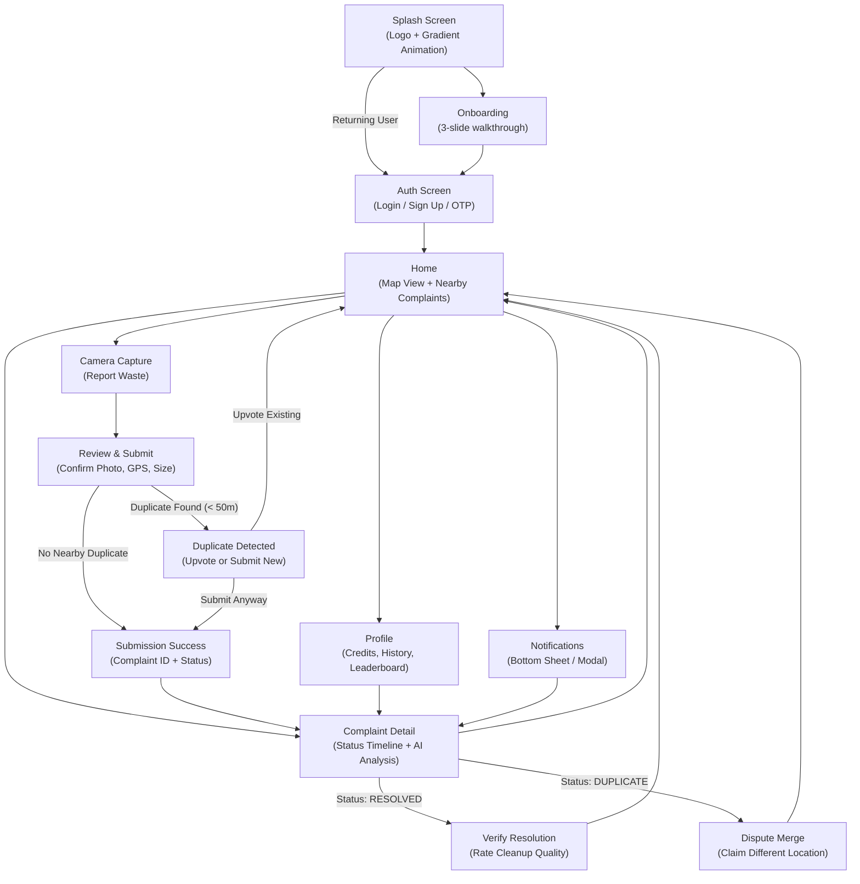
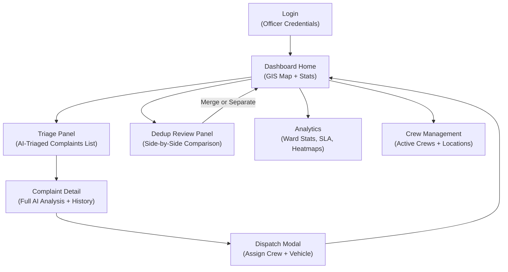

# 1. App Flow — Complete User Journey

This document defines every screen, navigation path, and decision point for both the **Citizen Mobile App** and the **Authority Web Dashboard**.

---

## Part A: Citizen Mobile App Flow

### Screen Map (Mermaid)

---

### Screen-by-Screen Specification

#### 1. Splash Screen
* **Duration:** 2 seconds (animated).
* **Visual:** Full-screen dark background (`#0C342C`) with the Ellipse logo at center. A gradient shimmer animation sweeps across the logo using Gradient 3 (`#E3EF26 → #076653 → #0C342C`).
* **Logic:**
  * Check local storage for an existing JWT token.
  * If valid token exists → navigate directly to **Home**.
  * If no token / expired → check if first-ever launch.
    * First launch → navigate to **Onboarding**.
    * Returning user (has seen onboarding) → navigate to **Auth**.

#### 2. Onboarding (First Launch Only)
* **Format:** 3 horizontally swipeable slides with a "Skip" button in the top-right and a "Get Started" button on the final slide.
* **Slide 1 — "Spot It":** Illustration of a phone camera pointing at a garbage pile. Text: *"See waste in your neighborhood? Snap a photo to report it instantly."*
* **Slide 2 — "AI Analyzes It":** Illustration of a brain/AI icon scanning the photo. Text: *"Our AI classifies the waste, estimates severity, and alerts the nearest cleanup crew."*
* **Slide 3 — "Track It":** Illustration of a timeline with checkmarks. Text: *"Follow your report from submission to resolution. Earn credits for keeping your city clean."*
* **Navigation:** "Get Started" → **Auth Screen**.
* **Persistence:** Set `hasSeenOnboarding = true` in local storage. Never show onboarding again.

#### 3. Auth Screen (Login / Sign Up / OTP)
* **Layout:** Dark background with the Ellipse logo at top. Two tabs: "Login" and "Sign Up".
* **Sign Up Tab:**
  * Fields: Full Name, Phone Number, Ward (dropdown or auto-detect from GPS).
  * Button: "Send OTP" → triggers OTP to phone.
  * OTP Entry: 6-digit input with auto-focus and auto-submit.
  * On success → JWT stored locally → navigate to **Home**.
* **Login Tab:**
  * Field: Phone Number.
  * Button: "Send OTP" → same OTP flow.
  * On success → navigate to **Home**.
* **Error States:**
  * Invalid phone number format → inline red text below field.
  * OTP expired (after 2 minutes) → "Resend OTP" button appears.
  * Rate limit hit (3 OTP requests in 10 minutes) → "Too many attempts. Try again in 10 minutes."

#### 4. Home Screen (Map View + Nearby Complaints)
* **Layout:** Full-screen map (Mapbox GL) with a floating action button (FAB) at bottom-center for "Report Waste". Bottom sheet shows a scrollable list of nearby complaints.
* **Map Features:**
  * User's current location shown as a pulsing lime dot (`#E3EF26`).
  * Nearby complaints shown as color-coded pins:
    * 🔴 Red: Severity > 0.75 (critical)
    * 🟠 Orange: Severity 0.50–0.75 (moderate)
    * 🟡 Yellow: Severity 0.25–0.50 (low)
    * 🟢 Green: Resolved
  * Tapping a pin opens a preview card (thumbnail, status badge, distance).
  * Preview card tap → navigates to **Complaint Detail**.
* **Bottom Sheet (Collapsed):**
  * Title: "Nearby Reports" with count badge.
  * Horizontal scrollable complaint cards (image thumbnail, status, distance, time ago).
* **Bottom Sheet (Expanded):**
  * Full list view with filters: All / My Reports / Resolved.
* **FAB Button:** Lime (`#E3EF26`) circular button with camera icon. Tap → navigate to **Camera Capture**.
* **Top Bar:** Profile avatar (left) → **Profile**. Bell icon (right) → **Notifications** (bottom sheet modal).

#### 5. Camera Capture Screen
* **Layout:** Full-screen camera viewfinder with overlay guidelines.
* **Capture-Only Mode:** Gallery picker is intentionally hidden. Only live camera capture is allowed (anti-fraud measure).
* **Pre-Capture UI:**
  * Crosshair/frame overlay suggesting where to position the waste pile.
  * Auto-focus indicator.
  * Blur detection: If the frame is too blurry, show a warning toast: *"Hold steady for a clearer photo."*
  * GPS lock indicator: Green dot if GPS is locked, red dot if still acquiring. Disable shutter button until GPS is acquired.
* **Shutter Button:** Large lime (`#E3EF26`) circle at bottom center. Tap → capture photo → navigate to **Review & Submit**.
* **Cancel:** "X" button in top-left → confirm dialog → back to **Home**.

#### 6. Review & Submit Screen
* **Layout:** Captured photo displayed at top (60% of screen). Form fields below.
* **Auto-Populated (read-only):**
  * GPS coordinates (shown as a mini-map pin, not raw numbers).
  * Timestamp.
  * Compass heading.
* **User Input:**
  * **Size Estimate Picker:** 4 illustrated options in a horizontal selector:
    * 🪣 Bucket (< 0.5 m³)
    * 🛒 Handcart (0.5–2 m³)
    * 🚛 Truck (2–10 m³)
    * 🏗️ Heavy Equipment (> 10 m³)
  * **Optional Note:** Short text field (max 200 characters).
* **Submit Button:** Full-width lime button: "Submit Report".
* **On Submit:**
  * API call: `POST /citizen/complaints`
  * If **201 Created** → navigate to **Submission Success**.
  * If **409 Conflict (duplicate detected)** → navigate to **Duplicate Detected**.
  * If **429 Rate Limited** → show modal: *"You've reached the daily reporting limit. Try again tomorrow."*
  * If **422 GPS Mismatch** → show modal: *"Location mismatch detected. Please ensure you're at the waste site."*

#### 7. Duplicate Detected Screen
* **Trigger:** API returns 409 with a nearby existing complaint.
* **Layout:** Side-by-side comparison:
  * Left: User's photo (just captured).
  * Right: Existing complaint photo (from API response).
  * Similarity score badge: e.g., "87% match".
  * Distance badge: e.g., "23m away".
* **Two CTAs:**
  * **"Upvote Existing Report"** (lime outline button) → `POST /citizen/complaints/{id}/upvote` → toast: "+5 credits" → back to **Home**.
  * **"Submit as New Report"** (lime filled button) → re-submits with `force_new: true` → **Submission Success**.

#### 8. Submission Success Screen
* **Layout:** Animated checkmark (lime pulse animation on dark background).
* **Content:**
  * "Report Submitted!" heading.
  * Complaint ID (tappable to copy).
  * Status badge: "LOGGED — Queued for AI Analysis".
  * "Nearby Active Reports: 3" (from API response).
* **CTA:** "Track This Report" → **Complaint Detail**. "Back to Map" → **Home**.

#### 9. Complaint Detail Screen
* **Layout:** Scrollable single-complaint view.
* **Header:** Full-width photo with a gradient overlay (bottom fade to `#0C342C`). Status badge overlay in top-right.
* **Status Timeline (vertical):**
  * ✅ LOGGED — *"Aug 18, 7:42 PM — You reported this."*
  * ✅ AI_TRIAGED — *"Aug 18, 7:43 PM — AI classified: Organic, Plastic. Severity: High."*
  * ⏳ DISPATCHED — *"Aug 18, 8:10 PM — Crew assigned. ETA: 45 min."*
  * ⬜ RESOLVED — Pending.
  * ⬜ VERIFIED — Pending.
* **AI Analysis Card (expandable):**
  * Waste types detected (with icons).
  * Logistics tier recommendation.
  * Severity score with "Why this score?" link → expands to show weight breakdown.
* **Actions (contextual):**
  * If status is `RESOLVED` → "Verify & Rate Cleanup" button → **Verify Resolution**.
  * If status is `DUPLICATE` → "This is different — Dispute" link → **Dispute Merge**.

#### 10. Verify Resolution Screen
* **Guard:** User must NOT be the original reporter (API enforces this).
* **Layout:**
  * Before photo (left) vs. After photo (right) — side by side.
  * Star rating (1–5 stars, large tappable).
  * Optional comment field.
* **Submit:** `POST /citizen/complaints/{id}/verify` → toast: "+10 credits" → back to **Home**.

#### 11. Dispute Merge Screen
* **Trigger:** Citizen's complaint was auto-merged as a duplicate but they believe it's a different pile.
* **Layout:**
  * Their original photo + the complaint it was merged into, side by side.
  * Text: *"We merged your report with a nearby one. If you believe these are different waste sites, submit a dispute."*
  * Optional reason field.
* **Submit:** `POST /citizen/complaints/{id}/dispute-merge` → toast: *"Dispute filed. An officer will review."* → back to **Complaint Detail** (status reverts to LOGGED).

#### 12. Profile Screen
* **Layout:** Top section with user info card (name, ward, member since). Below: tabbed content.
* **Tab 1 — My Reports:**
  * List of all complaints submitted by the user.
  * Each item: thumbnail, status badge, date, credits earned.
  * Tap → **Complaint Detail**.
* **Tab 2 — Credits & Leaderboard:**
  * Total credits earned (large number, lime color).
  * Breakdown: "Reports: 45 credits, Verifications: 30 credits, Upvotes: 10 credits".
  * Ward leaderboard: Top 10 citizens by credits. Current user highlighted.
* **Tab 3 — Settings:**
  * Notification preferences toggle.
  * Ward selection.
  * Logout button.

#### 13. Notifications (Bottom Sheet Modal)
* **Trigger:** Bell icon on Home screen.
* **Format:** Bottom sheet (not a full screen). Slides up from bottom.
* **Items:** Chronological list of push notification history:
  * *"Your report #ABC123 has been assigned to a cleanup crew."*
  * *"A cleanup crew resolved report #ABC123. Verify it now!"*
  * *"Someone upvoted your report. +5 credits."*
* **Tap:** Each item navigates to the relevant **Complaint Detail**.

---

## Part B: Authority Web Dashboard Flow

### Screen Map (Mermaid)

### Screen-by-Screen Specification

#### 1. Login
* **Layout:** Centered card on dark background. Ellipse logo + "Authority Portal" subtitle.
* **Fields:** Email, Password.
* **RBAC:** After login, the JWT contains the user's role (`OFFICER`, `DISPATCHER`, `ADMIN`). The sidebar navigation adjusts based on role.

#### 2. Dashboard Home (GIS Command Center)
* **Layout:** Full-width Mapbox GL map occupying 70% of the viewport. Right sidebar (30%) with live stats and triage queue.
* **Map Features:**
  * Color-coded complaint clusters (same Red/Orange/Yellow/Green as mobile).
  * Clicking a cluster zooms in. Clicking a single pin opens a popup with complaint summary.
  * Live crew location markers (blue pulsing dots) updated via WebSocket.
  * Ward boundary overlays (togglable).
  * Historical heatmap layer (togglable).
* **Right Sidebar:**
  * **Live Stats:** Total active complaints, complaints triaged today, crews deployed, average resolution time.
  * **Recent Activity Feed:** Real-time WebSocket-driven list of new submissions, AI triage completions, and crew dispatches.
  * **Quick Filters:** Status (All / Logged / AI Triaged / Dispatched / Resolved), Severity (slider), Ward (dropdown).

#### 3. Triage Panel
* **Layout:** Sortable, filterable table/card list of AI-triaged complaints awaiting human review.
* **Columns:** Thumbnail, Location (ward/address), Waste Types, Severity Score, Logistics Tier, Volume Confidence, Time Since Submission, Upvote Count.
* **Sort:** Default by severity (descending). Sortable by any column.
* **Row Click:** Opens **Complaint Detail** in a slide-over panel.

#### 4. Complaint Detail (Officer View)
* **Layout:** Slide-over panel (right side) or full page.
* **Sections:**
  * Photo (zoomable) + mini-map showing exact GPS pin.
  * AI Analysis: Waste classes, severity score with "Explain" modal (shows weight breakdown from `severity_weight_versions`), logistics tier, volume estimate + confidence badge.
  * Status Timeline (same as mobile but with officer actions included).
  * Citizen Info: Reporter ID, total reports, flag history.
  * Dedup History: If this complaint was flagged as a potential duplicate, show the similar complaints.
* **Actions:**
  * "Dispatch Crew" button → opens **Dispatch Modal**.
  * "Override Severity" → manual severity adjustment with reason (logged).
  * "Flag as Fraudulent" → marks complaint, deducts citizen credits.

#### 5. Dispatch Modal
* **Layout:** Modal overlay.
* **Fields:**
  * Crew selection (dropdown of available crews with current location).
  * Vehicle type (auto-suggested from logistics tier, overridable): Manual Sweep / Handcart / Mini-Truck / Compactor.
  * PPE override checklist (auto-suggested from hazard flags).
  * Priority notes (optional text).
* **Submit:** `POST /authority/dispatch` → complaint status changes to `DISPATCHED` → WebSocket pushes update to mobile app → modal closes.

#### 6. Dedup Review Panel
* **Layout:** Side-by-side image comparison with map showing both GPS locations.
* **Content:**
  * Left image: Complaint A. Right image: Complaint B.
  * Similarity score badge.
  * Distance between GPS points.
  * Map with both pins.
* **Actions:** "Merge" or "Keep Separate" buttons → `POST /authority/dedup-reviews/{id}/decide`.
* **Queue:** List of all pending dedup reviews. Process one at a time.

#### 7. Analytics (Post-MVP)
* **Layout:** Multi-panel dashboard with charts.
* **Panels:**
  * Complaints over time (line chart).
  * Resolution time by ward (bar chart).
  * SLA compliance percentage.
  * Top hotspot locations (recurring dump sites).
  * Citizen engagement metrics.

#### 8. Crew Management
* **Layout:** Table of all registered crews with status.
* **Columns:** Crew ID, Current Assignment, Location (live from GPS), Status (Available / Dispatched / On-Site / Returning).
* **Map Integration:** Clicking a crew highlights them on the main dashboard map.
