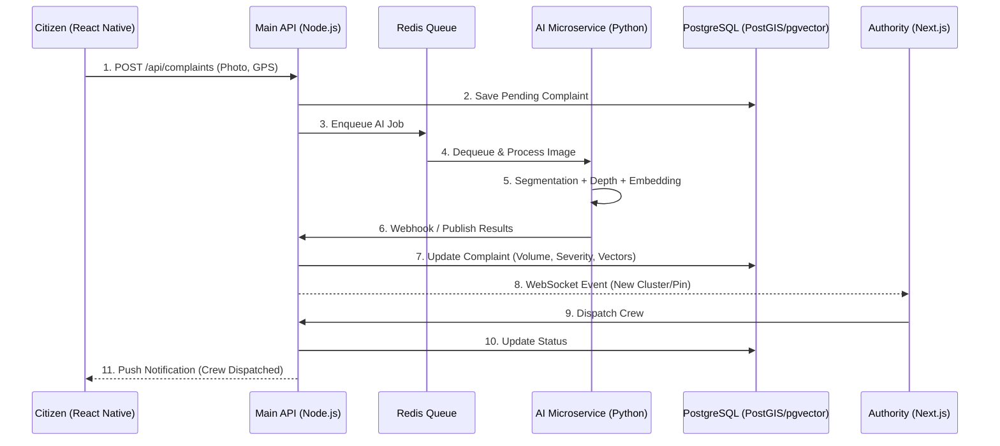

# Ellipse: AI-Powered Waste Response Decision Support System
## Product Requirement Document & System Architecture Blueprint

This document outlines the end-to-end PRD, System Architecture, and Technical Execution Plan for Ellipse, a unified platform connecting citizens and municipal authorities.

> [!IMPORTANT]
> **User Review Required**
> Please review the architectural decisions, database schema, and API contracts. Once approved, we will transition to creating the task list for implementation.

## 1. Recommended System Architecture

Ellipse uses a **Polyglot Microservices Architecture**:
- **Citizen Mobile App:** Captures geo-tagged images, syncs offline, and tracks status.
- **Municipal Web Dashboard:** GIS command center for dispatch and tracking.
- **Main API (Node.js):** Centralized data hub, manages CRUD, auth, and WebSockets.
- **AI Microservice (Python):** Handles GPU-intensive ML tasks.

### Data Flow Diagram



## 2. Complete Technology Stack & Tooling Guidelines

- **Mobile App:** React Native (Expo), WatermelonDB (Offline-first), Expo Camera, Expo Location.
- **Web Dashboard:** Next.js (React), Tailwind CSS, Mapbox GL JS / React Map GL, Zustand (State).
- **Backend & Real-time Layer:** Node.js (NestJS or Express), Socket.io (WebSockets), Prisma ORM or Drizzle ORM.
- **AI Microservice:** Python (FastAPI), Celery / RQ.
- **Message Broker:** Redis (BullMQ for Node, Celery for Python).
- **Database:** PostgreSQL with `PostGIS` (spatial) and `pgvector` (embeddings).
- **AI / CV Models:**
  - *Segmentation:* YOLO11-seg (Ultralytics)
  - *Depth Estimation:* Depth Anything V2
  - *Embeddings:* DINOv2 or OpenAI CLIP (ViT-B/32)
- **Infrastructure:** Vercel (Next.js frontend), Render/Railway (Node API & DB), RunPod/AWS EC2 (Python GPU instances).

## 3. Unified Database Schema (SQL/DDL)

```sql
-- Enable necessary extensions
CREATE EXTENSION IF NOT EXISTS postgis;
CREATE EXTENSION IF NOT EXISTS vector;

-- Enums
CREATE TYPE user_role AS ENUM ('CITIZEN', 'OFFICER', 'DISPATCHER', 'ADMIN', 'FIELD_CREW');
CREATE TYPE complaint_status AS ENUM ('LOGGED', 'AI_TRIAGED', 'ASSIGNED', 'DISPATCHED', 'RESOLVED', 'DUPLICATE', 'REJECTED');
CREATE TYPE vehicle_class AS ENUM ('MANUAL_SWEEP', 'HANDCART', 'MINI_TRUCK', 'COMPACTOR');

-- Users Table
CREATE TABLE users (
    id UUID PRIMARY KEY DEFAULT gen_random_uuid(),
    role user_role NOT NULL,
    full_name VARCHAR(255) NOT NULL,
    email VARCHAR(255) UNIQUE,
    phone VARCHAR(20) UNIQUE,
    credits INT DEFAULT 0, -- Clean City Credits
    created_at TIMESTAMP WITH TIME ZONE DEFAULT CURRENT_TIMESTAMP
);

-- Complaints Table (Master)
CREATE TABLE complaints (
    id UUID PRIMARY KEY DEFAULT gen_random_uuid(),
    citizen_id UUID REFERENCES users(id),
    raw_image_url TEXT NOT NULL,
    location GEOGRAPHY(Point, 4326) NOT NULL, -- GPS Coordinates
    status complaint_status DEFAULT 'LOGGED',
    parent_complaint_id UUID REFERENCES complaints(id), -- For duplicates
    created_at TIMESTAMP WITH TIME ZONE DEFAULT CURRENT_TIMESTAMP,
    updated_at TIMESTAMP WITH TIME ZONE DEFAULT CURRENT_TIMESTAMP
);

-- AI Analysis Table
CREATE TABLE ai_analysis (
    id UUID PRIMARY KEY DEFAULT gen_random_uuid(),
    complaint_id UUID REFERENCES complaints(id) ON DELETE CASCADE,
    waste_classes JSONB, -- e.g., ["Plastic", "Organic"]
    volume_m3 DECIMAL(10, 4),
    severity_score DECIMAL(5, 4), -- 0.0 to 1.0
    hazard_flags JSONB, -- e.g., ["Bio-Hazard", "E-Waste"]
    logistics_tier INT, -- 1 to 4
    image_embedding vector(768), -- For deduplication (pgvector)
    analyzed_at TIMESTAMP WITH TIME ZONE DEFAULT CURRENT_TIMESTAMP
);

-- Deduplication Clusters (Optional materialized view or table for fast spatial-temporal grouping)
-- Used when multiple complaints fall into the same 50m radius and have > 0.8 cosine similarity.

-- Dispatch Orders Table
CREATE TABLE dispatch_orders (
    id UUID PRIMARY KEY DEFAULT gen_random_uuid(),
    complaint_id UUID REFERENCES complaints(id),
    crew_id UUID REFERENCES users(id),
    vehicle vehicle_class,
    ppe_required JSONB,
    before_photo_url TEXT,
    after_photo_url TEXT,
    citizen_rating INT CHECK (citizen_rating >= 1 AND citizen_rating <= 5),
    resolved_at TIMESTAMP WITH TIME ZONE
);

-- Spatial and Vector Indexes
CREATE INDEX idx_complaints_location ON complaints USING GIST (location);
CREATE INDEX idx_ai_analysis_embedding ON ai_analysis USING hnsw (image_embedding vector_cosine_ops);
```

## 4. API Endpoint Specifications

### Citizen Endpoints (Node.js)
- `POST /api/citizen/complaints` (Multipart form data: Image, Lat, Lng, Heading). Creates ticket, caches if offline.
- `GET /api/citizen/complaints/nearby?lat=...&lng=...&radius=50` (Returns active complaints in 50m to offer Upvote).
- `POST /api/citizen/complaints/:id/upvote` (Increments priority, links to master complaint).
- `POST /api/citizen/complaints/:id/verify` (Submit rating after field crew resolves).

### Authority Web Endpoints (Node.js)
- `GET /api/authority/complaints/heatmap` (Returns GeoJSON clusters colored by severity).
- `GET /api/authority/complaints/:id` (Full AI analysis, photos, history).
- `POST /api/authority/dispatch` (Body: complaint_id, crew_id, vehicle_class. Updates status, sends push to citizen).
- `WS /socket/authority` (Live stream of new AI-triaged complaints).

### AI Service Internal Webhooks (Python)
- `POST /internal/ai/process` (Called by queue worker. Body: image_url, location. Returns Volume, Classes, Embedding, Severity).
- Python Worker makes `PATCH /api/internal/complaints/:id/ai-results` to update the Node API securely.

## 5. AI Model Pipeline & Integration Guide

### Training & Fine-Tuning
1. **Dataset Sourcing:** TACO (Trash Annotations in Context) dataset combined with municipal-specific images.
2. **Segmentation (YOLO11-seg):**
   - Pre-process annotations into YOLO format.
   - Fine-tune on custom waste classes.
   - Export to ONNX or TensorRT (FP16) for fast inference.
3. **Monocular Volume Estimation:**
   - Run original image through `Depth Anything V2` to get relative depth map.
   - Use segmentation mask from YOLO to isolate the waste pile in the depth map.
   - Calibrate relative depth using camera intrinsics (if available) or assume a standard metric conversion. Integrate the 3D point cloud over the masked area to calculate $m^3$.
4. **MCDM Severity Scoring (EWM-TOPSIS):**
   - Entropy Weight Method (EWM) to assign objective weights to: Volume, Hazard Level, Proximity to POIs (PostGIS query for schools/hospitals).
   - TOPSIS to rank complaints against the "ideal worst case".

### Deduplication Logic
- Query `PostGIS` for complaints within 50m logged in the last 48 hours.
- If matches found, query `pgvector`: `SELECT id, 1 - (image_embedding <=> $new_embedding) as similarity FROM ai_analysis WHERE id IN (...)`
- If similarity > 0.85, mark as duplicate and merge.

## 6. Local Development Setup & Prerequisites

**Prerequisites:**
- Node.js (v20 LTS), Python (3.10+)
- Docker & Docker Compose (for Postgres, PostGIS, pgvector, and Redis)
- CUDA Toolkit (if local GPU available)

**Setup Steps:**
1. **Infrastructure (Docker Compose):**
   Spin up `db` (Postgres+PostGIS+pgvector) and `redis`.
2. **Node API:**
   `npm install`, copy `.env`, `npm run build`, `npm run start:dev`.
3. **AI Microservice:**
   `python -m venv venv`, `pip install -r requirements.txt`, download model weights to `/weights/`, run `uvicorn main:app --reload`.
4. **Web Dashboard:**
   `npm install`, `npm run dev`.
5. **Mobile App:**
   `npx expo install`, `npx expo start` (scan via Expo Go).

## 7. Phased Implementation Roadmap

- **Sprint 1: Foundation & Infrastructure:** Setup mono/poly-repo, Docker compose (DB, Redis), DB schema migrations.
- **Sprint 2: Core API & AI Pipeline:** Node CRUD endpoints, Python FastAPI setup, YOLO/Depth inference scripts, Celery queue integration.
- **Sprint 3: Authority Web Dashboard:** Next.js map integration (Mapbox), Real-time WebSockets, triage lists.
- **Sprint 4: Citizen Mobile App:** React Native camera capture, offline queue, GPS extraction, upload flow.
- **Sprint 5: Advanced AI & Gamification:** Deduplication via pgvector, EWM-TOPSIS severity scoring, Clean City Credits ledger.
- **Sprint 6: Field Testing & DevOps:** Cloud deployment (Vercel, Render, RunPod), end-to-end field testing, performance tuning (ONNX exports).
