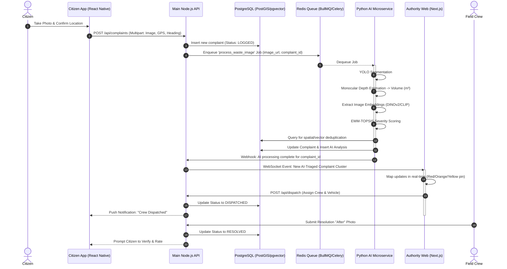

# 1. Recommended System Architecture

## Architectural Pattern: Polyglot Microservices

For the **Ellipse** AI-powered waste response decision support system, the recommended architectural pattern is a **Polyglot Microservices Architecture**. This approach isolates the high-throughput, low-latency CRUD operations and WebSocket connections from the highly intensive, synchronous (or queued) Machine Learning inference tasks.

### Core Components
1. **Mobile App (Citizen Edge):** A React Native (Expo) app functioning as an offline-first distributed sensor.
2. **Web Dashboard (Authority Edge):** A Next.js-based GIS operational command center for municipal dispatchers.
3. **Main API (Node.js/Express or NestJS):** Centralized data hub acting as the primary backend. It manages all DB reads/writes, authentication (JWT/RBAC), and real-time WebSocket events.
4. **AI Microservice (Python/FastAPI):** A decoupled worker service specifically optimized for loading PyTorch/ONNX models into GPU memory, performing instance segmentation, depth estimation, and vector generation.
5. **Shared Database Layer:** Both the Node.js API and Python Microservice securely access a unified PostgreSQL instance enriched with PostGIS (for spatial tracking) and pgvector (for visual deduplication).

---

## Data Flow Diagram (End-to-End Lifecycle)

