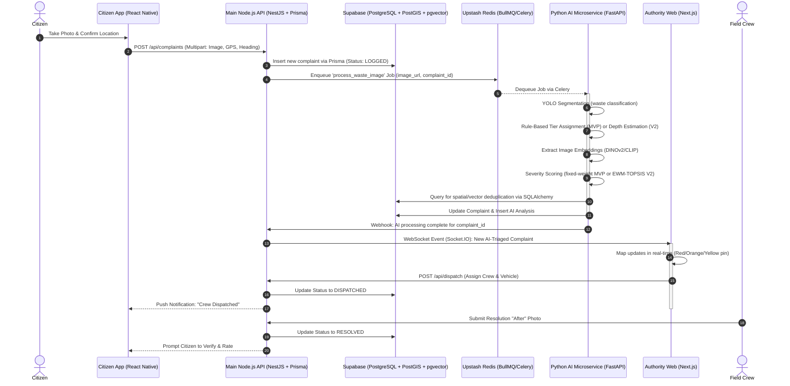

# 1. Recommended System Architecture

## Architectural Pattern: Polyglot Microservices

For the **Ellipse** AI-powered waste response decision support system, the recommended architectural pattern is a **Polyglot Microservices Architecture**. This approach isolates the high-throughput, low-latency CRUD operations and WebSocket connections from the highly intensive, synchronous (or queued) Machine Learning inference tasks.

### Core Components
1. **Mobile App (Citizen Edge):** A React Native (Expo) app functioning as an offline-first distributed sensor.
2. **Web Dashboard (Authority Edge):** A Next.js-based GIS operational command center for municipal dispatchers.
3. **Main API (Node.js / NestJS):** Centralized data hub acting as the primary backend. It manages all DB reads/writes via **Prisma ORM**, authentication (JWT/RBAC), and real-time WebSocket events (Socket.IO).
4. **AI Microservice (Python / FastAPI):** A decoupled worker service specifically optimized for loading PyTorch/ONNX models into GPU memory, performing instance segmentation, depth estimation, and vector generation. Connects to the same database via **SQLAlchemy**.
5. **Shared Database Layer — Supabase (Cloud PostgreSQL):** Both the Node.js API and Python Microservice connect to a single **Supabase**-hosted PostgreSQL instance via standard connection strings. Supabase provides PostGIS (spatial tracking), pgvector (visual deduplication), and Storage (complaint photos). Access is always through Prisma/SQLAlchemy — never through the Supabase JS client — keeping the database fully swappable to AWS RDS, Neon, or self-hosted PostgreSQL.
6. **Task Queue — Upstash Redis (Cloud):** Asynchronous AI job queue. Node.js pushes jobs via BullMQ; Python consumes via Celery. No local Redis installation needed.

---

## Data Flow Diagram (End-to-End Lifecycle)

